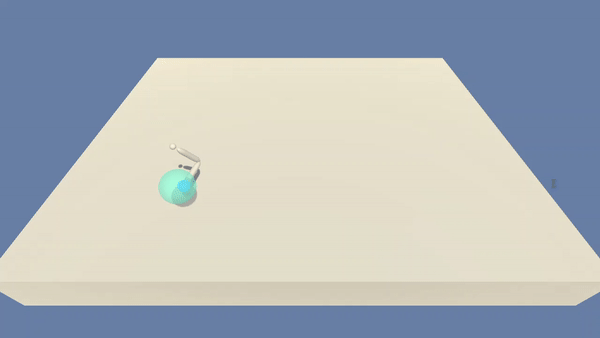
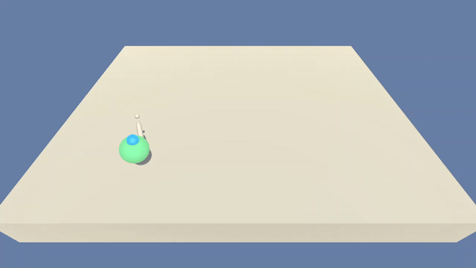
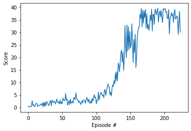
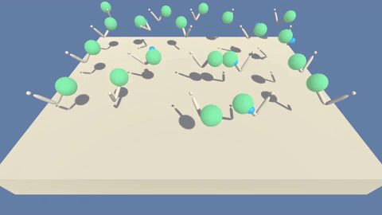
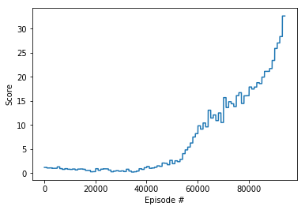

# Robotic Control Project
This project demonstrates the use of the Deep Deterministic Policy Gradient(DDPG) algorithm to solve a continuous environment. It involves the use of two Neural Networks, one called the Actor network and the other Critic network. The architecture works with the Actor network taking the actions in the given action space and the Critic network evaluating the values of the states/actions. The environment was provided by Unity, wherein the agent/agents has to control a set of double-jointed robotic arms to follow target locations. A reward of +0.1 is provided for each step that the agent's hand is in the goal location. The observation space consists of 33 variables corresponding to position, rotation, velocity, and angular velocities of the arm. Each action is a vector with four numbers, corresponding to torque applicable to two joints. Every entry in the action vector should be a number between -1 and 1.

### Environment
A sample video of the environment provided by Unity, with random movements.
| Single Arm             |  20 Arms |
:-------------------------:|:-------------------------:
  |  

## Learning Algorithm
The learning algorithm used was a Deep Deterministic Policy Gradient, an off-policy Reinforcement Learning method for solving continuous action space environments. 

 In DDPG, the Actor directly maps states to actions (the output of the network directly the output) instead of outputting the probability distribution across a discrete action space

 ### Pseudo Code
 

 ## Model Architecture
 ### Single Arm
 The Actor networks utilised two fully connected layers with both of them having 64 units with relu activation and tanh activation for the action space. The network has an initial dimension the same as the state size.

 The Critic networks utilised two fully connected layers with both of them having 64 units with relu activation. The critic network has an initial dimension the size of the state size plus action size.

 ### 20 Arms
 The Actor networks utilised two fully connected layers with both of them having 128 units with relu activation and tanh activation for the action space. The network has an initial dimension the same as the state size.

 The Critic networks utilised two fully connected layers with both of them having 128 units with relu activation. The critic network has an initial dimension the size of the state size plus action size.

 ## Hyperparameters
 ### Single Arm
 | Hyperparameter                      | Value |
  | ----------------------------------- | ----- |
  | Replay buffer size                  | 10000|
  | Batch size                          | 256   |
  | gamma (discount factor)             | 0.9  |
  | tau                                 | 0.002 |
  | Learning rate actor                 | 1e-3  |
  | Learning rate critic                | 1e-3  |

 ### 20 Arms
  | Hyperparameter                      | Value |
  | ----------------------------------- | ----- |
  | Replay buffer size                  | 100000|
  | Batch size                          | 128   |
  | gamma (discount factor)             | 0.99  |
  | tau                                 | 0.001 |
  | Learning rate actor                 | 5e-4  |
  | Learning rate critic                | 5e-4  |

  ## Result
  ### Single Arm
  The environment was solved in 124 episodes with an average score of `30.18` 
  
  #### Reward Plot
   

  ### Multiple Arms
  The environment was solved in 81 episodes wiht an average score of `30.02`
  
  #### Reward Plot
  

  ## Future Work 
  - Implementing a Rainbow DQN.
  - Experiment with more Actor-Critic algorithms like D4PG, A2C, AKTR
  - Further Hyperparamter tweaking can also lead to much better performance and/or efficiency.
  
